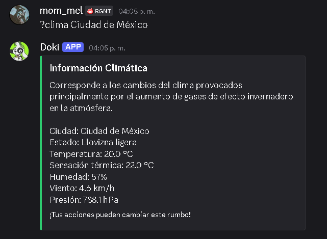
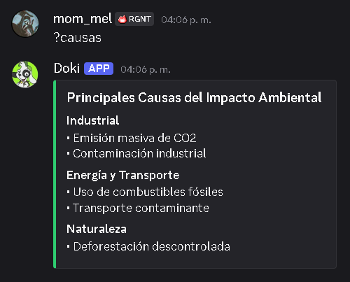
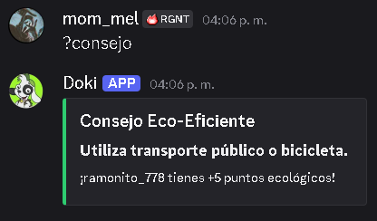
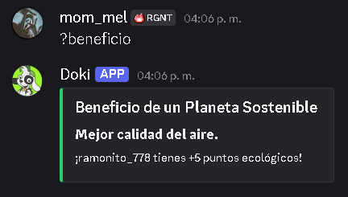
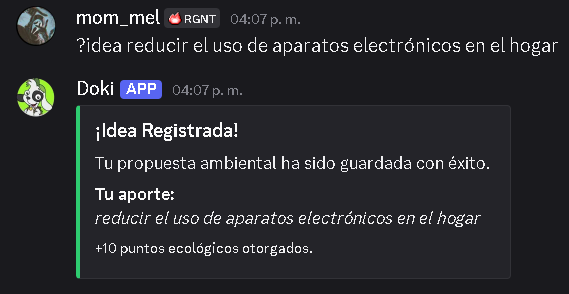
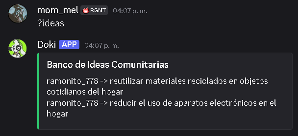
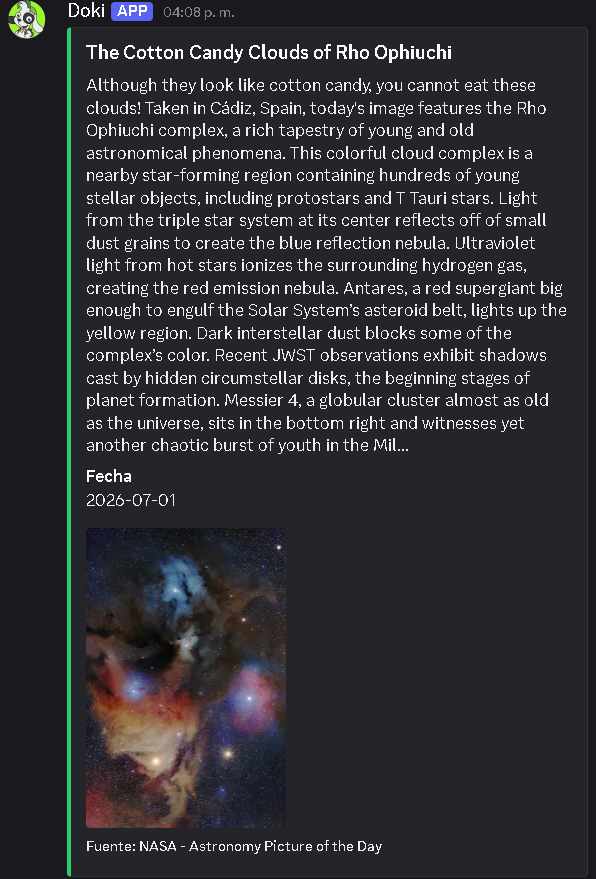
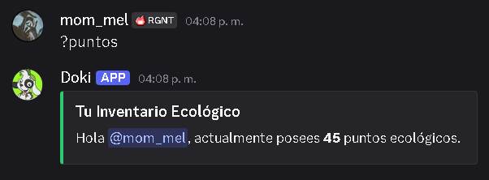
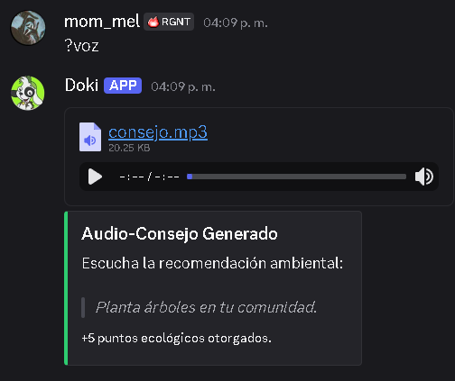
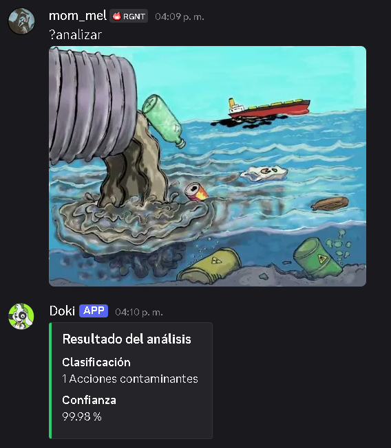

# Proyecto_de_Graduacion_-M10.L4-
Finalización de mi proyecto final sobre el tema principal del cambio climático

# ClimateBot

Bot de Discord desarrollado en Python que utiliza APIs para entregar información relacionada con el cambio climático mediante comandos interactivos.

## Descripción

Este proyecto tiene como finalidad demostrar el uso de APIs y Discord.py en el desarrollo de una aplicación capaz de informar sobre una problemática ambiental de gran importancia: el cambio climático.

El bot permite consultar información de forma rápida y sencilla, promoviendo el aprendizaje y la conciencia ambiental desde una plataforma de uso cotidiano.

## Tecnologías

- Python
- Discord.py
- APIs gratuitas como: NASA APOD API (Astronomy Picture of the Day), Open-Meteo y Useless Facts API
- Requests
- Git y GitHub

## Objetivo

Aplicar conocimientos de programación para desarrollar un bot funcional que combine tecnología y educación ambiental mediante el consumo de información desde APIs.

---

## Guía de Comandos y Posibles Errores

A continuación se detallan los comandos integrados en el sistema junto con una breve descripción de su comportamiento y los fallos lógicos o técnicos que podrían experimentar durante su ejecución.

### ?clima <ciudad>
* **Descripción**: Obtiene las coordenadas de la ciudad indicada y despliega datos meteorológicos actuales (temperatura, humedad, viento) para concientizar sobre las variaciones del clima local mediante la API Open-Meteo.

---

* **Posibles errores**: 
  * Fallo en la conexión de red (RequestException) si los servidores de Open-Meteo están caídos o no hay acceso a internet.
  * Retorno de valor nulo si el usuario escribe incorrectamente el nombre de la ciudad o ingresa caracteres especiales no reconocidos por la API de geocodificación.

### ?causas
* **Descripción**: Muestra un mensaje estructurado con las principales causas del impacto ambiental negativo a nivel industrial, energético y de transporte.

---

### ?consejo
* **Descripción**: Selecciona un consejo ambiental al azar desde una lista interna, lo envía en un formato visual estructurado e incrementa el balance del usuario en 5 puntos ecológicos.

---

### ?beneficio
* **Descripción**: Entrega un beneficio aleatorio derivado de la conservación ambiental y abona 5 puntos ecológicos al registro del usuario que invoca el comando.

---

### ?idea <propuesta>
* **Descripción**: Recibe una propuesta ecológica escrita por el usuario, la concatena dentro del archivo de texto "ideas.txt" para su posterior revisión y premia la acción con 10 puntos ecológicos.

---

* **Posibles errores**: 
  * Excepción de comando si el usuario no introduce ningún argumento después de invocar la función.

### ?ideas
* **Descripción**: Lee y expone en el canal de texto todas las ideas y propuestas almacenadas previamente en el archivo "ideas.txt".

---

* **Posibles errores**: Si el archivo acumulado de propuestas supera el límite físico de 2000 caracteres por mensaje impuesto por Discord, el bot fallará al intentar enviar un mensaje demasiado extenso.

### ?nasa
* **Descripción**: Conecta con la API de la NASA para extraer la imagen astronómica del día y su respectiva descripción técnica.

---

* **Posibles errores**: 
  * Error de autenticación (HTTP 403) si la variable de entorno "NASA_API_KEY" no está configurada correctamente en el archivo ".env" o ha expirado.
  * Error de visualización si el tipo de medio retornado por la NASA para ese día es un video en lugar de una imagen.

### ?puntos
* **Descripción**: Verifica y despliega la cantidad exacta de puntos ecológicos acumulados por el usuario de manera individual.

---

### ?ranking
* **Descripción**: Carga el archivo de puntos, ordena los registros de mayor a menor y genera una lista con las diez mejores puntuaciones del servidor.

---

### ?voz
* **Descripción**: Utiliza la librería gTTS para transformar un consejo de texto en un archivo de audio MP3, lo envía al canal de Discord y procede a eliminar el archivo temporal del almacenamiento local. Otorga 5 puntos ecológicos.

---

* **Posibles errores**: 
  * Fallo por tiempo de espera si los servidores de Google TTS no responden a la solicitud de conversión de voz.

### ?analizar
* **Descripción**: Descarga una imagen adjuntada por el usuario y la procesa mediante un modelo de inteligencia artificial de Keras para clasificar el tipo de clase y su porcentaje de confianza.

---

* **Posibles errores**: 
  * Error de índice si el usuario ejecuta el comando sin adjuntar una imagen.
  * Error de manipulación de imagen si el archivo adjunto está corrupto o no puede ser convertido al formato RGB por la librería PIL.

### ?help
* **Descripción**: Despliega un menú personalizado que describe detalladamente la sintaxis y función de cada comando ecológico disponible, reemplazando la asistencia por defecto de Discord.py.

---
Desarrollado por **Rommel Moncada**
